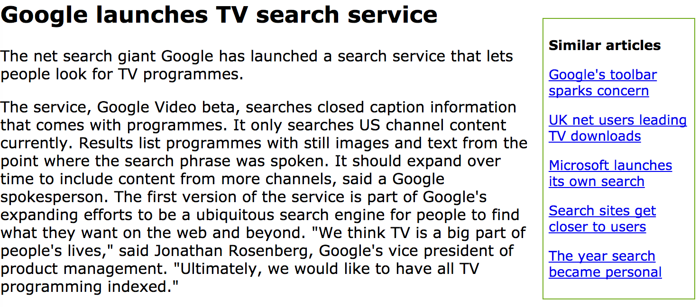

# Content-Based News Articles Recommender System

This project aims to develop a content-based news articles recommendation engine using word embeddings, specifically utilizing the GloVe word vectors trained on Wikipedia pages. The recommendation engine is complemented by a Flask web server that provides a user-friendly interface for accessing and exploring recommended articles.

## Project Structure

The project is divided into two main parts:

1. **Part 1: Building the Recommendation Engine**
   - Implemented in `doc2vec.py`
   - The goal is to create a database of recommendations by processing word vectors and a corpus of text articles.
   - Deliverables include `articles.pkl` and `recommended.pkl`.
   - Validation is performed using `pytest -v test_doc2vec.py`.

2. **Part 2: Developing the Flask Web Server**
   - Implemented in `server.py` and associated templates (`articles.html` and `article.html`).
   - The web server provides routes for accessing the list of articles and individual article pages.
   - Validation is performed using `pytest test_server.py`.

## Getting Started

To set up the project locally, follow these steps:

1. Download the starter kit from the provided link, containing necessary files and directory structure.
2. Download the required data files:
   - GloVe word vectors: [glove.6B.300d.txt.zip](https://s3-us-west-1.amazonaws.com/msan692/glove.6B.300d.txt.zip)
   - BBC articles corpus: [bbc.zip](https://s3-us-west-1.amazonaws.com/msan692/bbc.zip)
3. Extract the downloaded zip files into the `~/data` directory.
4. Run the command `python doc2vec.py ~/data/glove.6B.300d.txt ~/data/bbc` to generate the necessary files for the recommendation engine.

## Project Details

### Word Vector Centroids
This project implements a content-based news article recommender system using word embeddings and Euclidean distance. Each word in the corpus is represented by a 300-dimensional vector derived from the GloVe project. By computing the centroid of a document's cloud of word vectors, related articles are identified based on their proximity in the 300-dimensional space.

Euclidean distance is then calculated between centroids to measure the similarity between articles. This distance metric quantifies the overall dissimilarity between articles' semantic content. Articles with centroids that are closer together in the 300-dimensional space are considered more similar and are recommended to users who have interacted with a given article.

### Web Server
The Flask web server provides routes for accessing articles and recommendations:
- The main page displays a list of articles at `/`.
- Each article is accessible at `/article/<topic>/<filename>`, following the structure of the BBC corpus.
- Jinja2 template engine is utilized for generating HTML content dynamically.

## Screenshots

### List of Articles (extract)

Clicking on one of those articles takes you to an article page that shows the text of the article as well as a list of five recommended articles:

### Article Page with Recommendations (1)

### Article Page with Recommendations (2)

## Conclusion

This project demonstrates the implementation of a simple yet effective article recommendation system using word embeddings and a Flask web server. One potential future enhancement could involve collecting user ratings data to provide personalized recommendations. By incorporating collaborative-filtering techniques, such as a matrix factorization, the recommendation engine could offer more tailored suggestions based on individual user preferences and behaviors.
